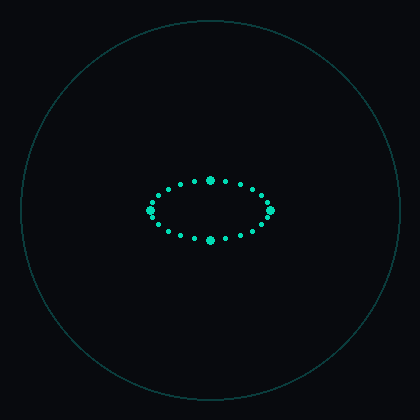
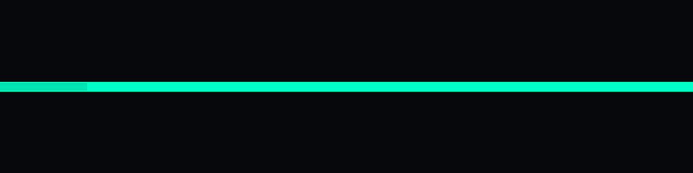
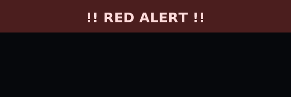

<h1>Adeepa Adithya</h1>
<h3>CEH Student |  Ethical Hacker</h3>
<h6>Permission First , Skills Second</h6>
 

###  About

**Adeepa Adithya** — CEH student. Future threat hunter. Ethical by default, curious by design.

**Focus:** Pentesting · Network Security · Malware basics · SOC fundamentals

###  Tech & Tools
**Languages:** Python • Java • C++  
**Pentest Tools:** Nmap • Metasploit • Burp Suite • Hydra • Wireshark  
**OS / Labs:** Kali Linux • Parrot • TryHackMe • HackTheBox

###  Skill Matrix
| Area | Tools |
|-----:|:-----|
| Pentesting | Nmap • Metasploit • Burp Suite |
| Network Analysis | Wireshark • tcpdump |
| Programming | Python • Java • C++ |
| Labs & Practice | TryHackMe • HTB • Kali |

